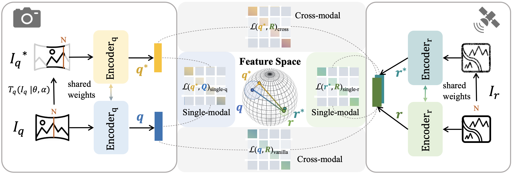

# ConGeo
Official method implementation for the ECCV24 paper: ConGeo: Robust Cross-view Geo-localization across Ground View Variations. [arxiv](https://arxiv.org/abs/2403.13965)

## Introduction
ConGeo is a learning framework that can be applied to base Cross-View Geo-Localization (CVGL) architectures for robust CVGL across ground view variations using a single model.



## Installation and Get Started

Required environments:
- Linux
- Python 3.7+
- PyTorch 1.10.0+
- CUDA 9.2+
- GCC 5+

Install:
Please follow the following steps for installation.

```
git clone https://github.com/eceo-epfl/ConGeo.git
cd ConGeo
pip install -r requirements.txt
```

## Usage:
We take the CVUSA for example to illustrate the usage of this repo:
- Set the path in [dataset](ConGeo/congeo/dataset/cvusa.py) and [training](ConGeo/train_congeo_cvusa.py) configurations to the dataset path.
- Train by running:
```
python train_congeo_cvusa.py
```
- Eval by running:
```
python eval_cvusa.py
```

Tips:
- Change the "train_fov" configration in the training code to customize your training mode:
```
0.0: north-aligned, value between (0.0, 360.0): limited FoV, 360.0: arbitrary orientations
```
- Change the "fov" configration in the eval code to change evaluation settings:
```
0.0: north-aligned, value from (70.0, 90.0, 180.0): limited FoV, 360.0: arbitrary orientations
```
- Set "train_fov=360", and "random_fov=True" can enable training with random FoVs between (70, 360) degrees

## Citation and Acknowledgement:
We would like to thank the authors of [Sample4Geo](https://github.com/Skyy93/Sample4Geo) for the code basis of this work. If you find this work helpful, please consider citing:
```bibtex
@article{mi2024congeo,
  title={ConGeo: Robust Cross-view Geo-localization across Ground View Variations},
  author={Mi, Li and Xu, Chang and Castillo-Navarro, Javiera and Montariol, Syrielle and Yang, Wen and Bosselut, Antoine and Tuia, Devis},
  journal={arXiv preprint arXiv:2403.13965},
  year={2024}
}

@inproceedings{deuser2023sample4geo,
  title={Sample4geo: Hard negative sampling for cross-view geo-localisation},
  author={Deuser, Fabian and Habel, Konrad and Oswald, Norbert},
  booktitle={Proceedings of the IEEE/CVF International Conference on Computer Vision},
  pages={16847--16856},
  year={2023}
}
```